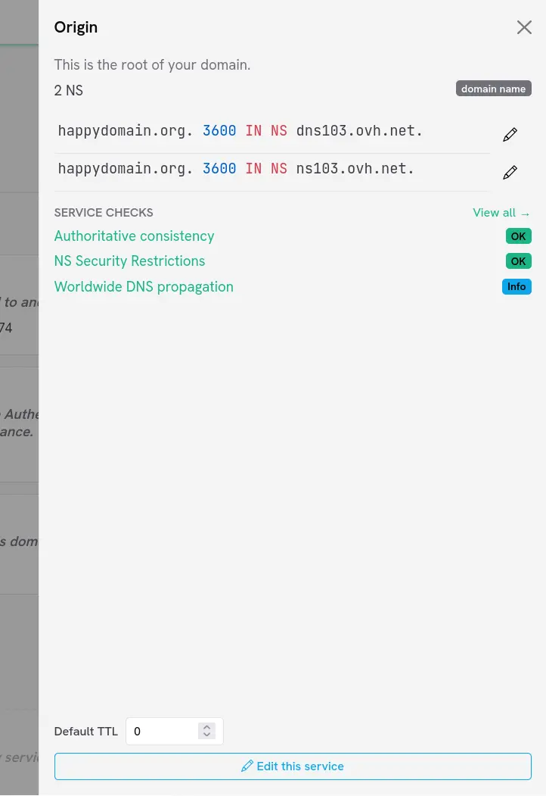

The zone editor is the main screen for working with a domain. It presents the content of your zone grouped by subdomain, and lets you add, edit and delete the services and records that make up your zone, all without touching your hosting provider until you decide to [publish changes]({}).

## The editor layout

When you open a domain, the screen is split in two parts:

- On the left, a **sidebar** lists every subdomain of the zone. It also gives access to domain-wide actions (history, audit log, checks, WHOIS, import/export, etc.).
- On the right, the **Zone Viewer** displays the content of the zone, one block per subdomain.

At the very top of the sidebar you will find the **Add a subdomain** button and a gear menu grouping the other actions. The button used to send your changes to your provider (**Publish my changes**) is also reachable from here; see [this page]({}) for details.

{}
Every change you make in the editor is kept locally in happyDomain. It is only transmitted to your hosting provider once you explicitly publish it.
{}

## Browsing the zone

The zone is organised **by subdomain**. The root of the domain is shown first (displayed with the bare domain name), followed by each subdomain. Intermediate subdomains that hold no service of their own are still shown, marked with a dotted icon, so you can always see the full tree.

- Click a subdomain heading to **expand or collapse** it and reveal the services it contains.
- When a block is collapsed, a badge shows how many services it holds; hover it to get a quick summary.
- Use the **sidebar** to jump straight to a subdomain: it mirrors the list and scrolls the viewer to the matching block.

Aliases pointing to a subdomain are shown next to its heading with a `+ N aliases` badge.

<!-- TODO: screenshot of a subdomain block expanded, showing its services -->

## Records and services

happyDomain does not show you a raw list of DNS records by default. Instead, it groups related records into **services**, higher-level objects that are easier to reason about (a mail server, a website, a delegation, etc.). Each service expands into the actual records it generates.

If you prefer to work directly with individual records, you can switch the zone view mode in your [account settings]({}). The editor then offers an **Add a record** button instead of **Add a service**.

## Adding a subdomain

1. Click **Add a subdomain** at the top of the sidebar.
2. Enter the name of the subdomain to create (relative to your domain).
3. happyDomain then proposes to add a first service on that subdomain right away.

A subdomain only really exists once it carries at least one service, so the two steps are chained together.

## Adding a service

To add a service to an existing subdomain:

1. Locate the subdomain block (or the domain root) in the viewer.
2. Click the **+** button on the subdomain heading, or use the **Add a service** action.
3. Pick the service type from the selector. The list adapts to what already exists on that subdomain (for instance, you cannot add two conflicting services).
4. Fill in the form for the chosen service, then save.

## Inspecting a service

Click a service to open the **details panel** that slides in from the right. It shows:

- A description of the service type and any comment you set.
- The concrete DNS records the service produces.
- The propagation status (when the change was last published).
- Any health checks attached to that service (see {}).

From this panel you can also adjust the **default TTL** of the service, edit it, or delete it.

## Editing a service

1. Open the service details panel, then click **Edit this service**; or use the pencil button shown on simple services such as aliases.
2. happyDomain opens the full editing form for the service.
3. Make your changes and save. The viewer refreshes to reflect them.

## Deleting a service

1. Open the service details panel.
2. Click **Delete this service**.

The service and all the records it generated are removed from your working copy of the zone.

{}
The origin service of a zone (the one carrying the SOA and the authoritative name servers) is essential and cannot be deleted from the editor.
{}

For aliases (CNAME) and reverse pointers (PTR), a dedicated delete button is available directly on the subdomain heading.

## Aliases

When a subdomain holds services, you can attach an **alias** to it using the link button on its heading. The alias makes another name resolve to this subdomain.

## Next steps

None of the above changes anything at your hosting provider yet. When you are happy with your edits:

- Review what will change, then send the changes; see {}.

You can also re-import the live zone, or import/export it as a standard zone file: see {}.
