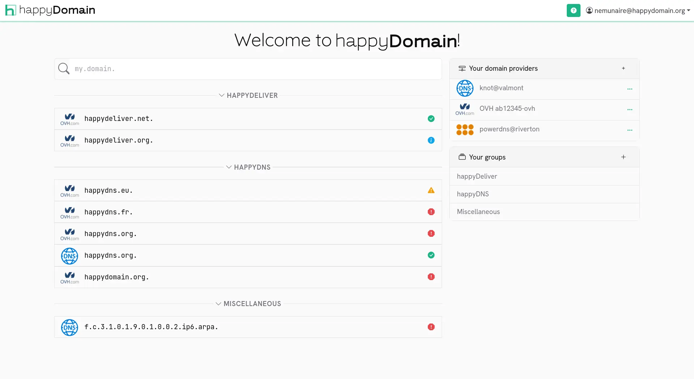
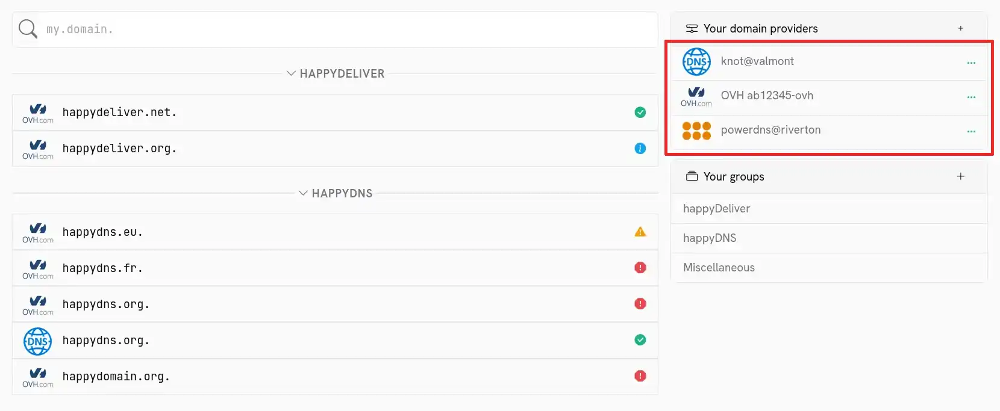
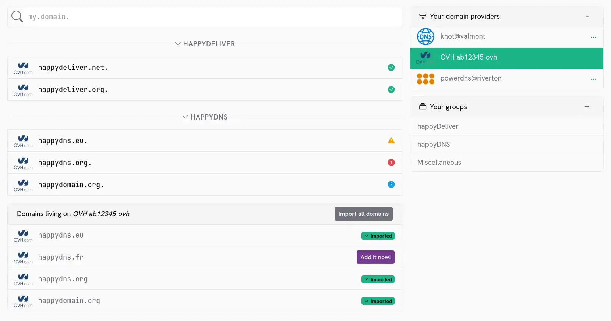
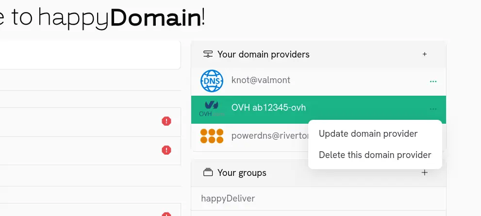
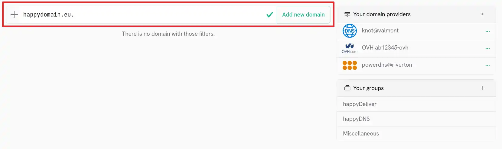
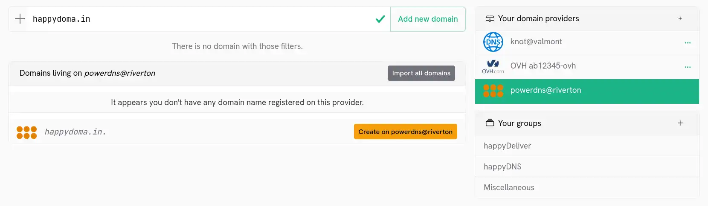

happyDomain provides you with a unified graphical interface with modern features, regardless of where your domain names are hosted. They can be on a DNS server (PowerDNS, bind, knot, ...) of your own, or with one or several providers (around 50 are currently supported).

## Your domains

The home page presents the list of all the domains managed by happyDomain, whatever their host:

Click one of the domains to start [make changes]({}) (add a sub-domain, add a service, ...).

## Your registries and domain hosts

On the right, you can see the list of the different hosting providers for your:

You can [add new host]({}) by clicking on the + button in the table header.

Clicking on a row in this table will filter the list of domains to show only domains managed by this host.

You will also see, if the host allows you to list the domains that belong to you, the domains that you can add to happyDomain:

To view the entire list again, simply click on the selected host again.

### Modify or remove a host

If you find an error or no longer need a hosting provider, click on the ... on the line of the host concerned. You will then be able to choose between [update information]({}) or delete the host:

Note that you will not be able to remove the host as long as domains referring to it exist in the list on the left.

## Add a domain

You have a new domain you want to manage in happyDomain? Start by entering its name in the field above the list. You will then be guided to the screen [to choose the host]({}).

Some DNS providers allows you to create a domain directly in their database, even if it was not already registered. First, you'll need to select the right provider. You'll see a dedicated "Create on" button.

Some providers could charge you for this action, so pay attention if this implies to realy buy the domain.
