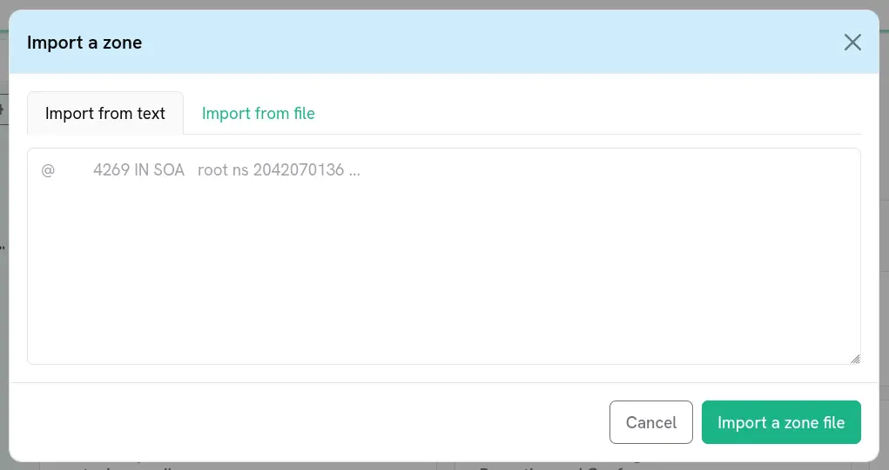
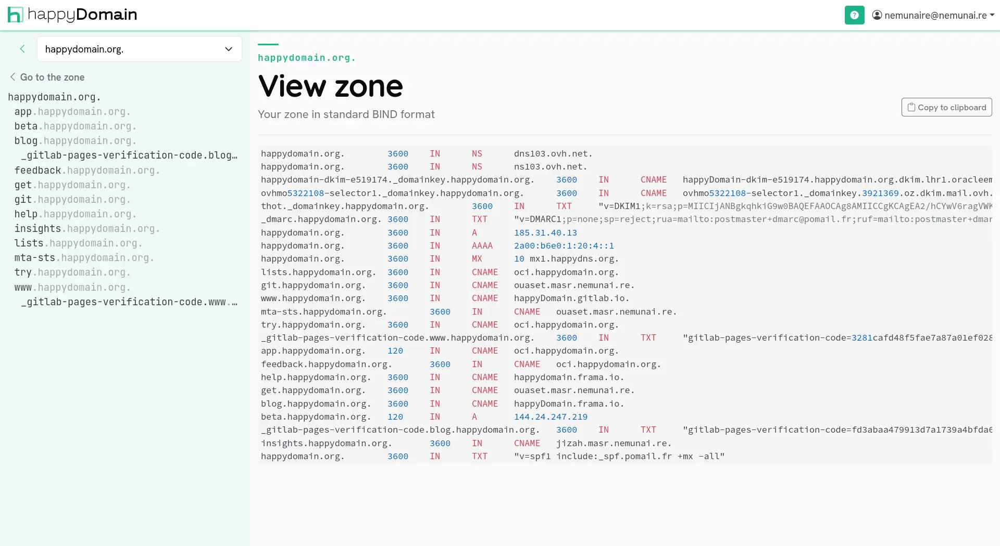

happyDomain can exchange your zone with the rest of the DNS world using the standard zone file format (the well-known BIND format). You can **import** a zone file to populate your working copy, and **export** the current zone to read it, copy it, or keep it elsewhere.

These actions are available from the gear menu at the top of the zone editor sidebar.

## Re-importing the live zone

Before working with files, it is worth knowing that you can always pull the **current** zone back from your provider. In the gear menu, choose **Retrieve the current zone**.

This contacts your hosting provider, reads the zone as it stands right now, and refreshes your working copy from it. Use it when the zone may have been changed outside happyDomain, or to start again from a clean state.

{}
Re-importing the live zone fetches the provider's version. Any local change you had not yet published may be superseded, so review your pending changes first (see {}) if you want to keep them.
{}

## Importing a zone file

To load a zone from a standard zone file:

1. Open the gear menu in the sidebar and choose the **upload / import a zone** action.
2. A dialog opens with two tabs:
   - **From text** -- paste the content of a zone file directly into the text area.
   - **From a zone file** -- select a file from your computer.
3. Click the upload button to send it.

happyDomain parses the zone file, recognises the records, and groups them back into services in your working copy. As with every other edit, the imported content stays local until you publish it.

{}
The expected format is the standard textual zone file, the same one BIND and most DNS tools use. A line such as `@ 4269 IN SOA root ns 2042070136 ...` is a typical example of what you can paste.
{}

## Exporting / viewing the zone

To obtain your zone as a standard zone file:

1. Open the gear menu and choose **View my zone**.
2. happyDomain renders the current zone in standard BIND format, with syntax highlighting.
3. Use the **Copy to clipboard** button to grab the whole file in one click.

This view always reflects the zone you are currently looking at. If you are browsing a past version from the {}, the export shows that historical version, which is handy for comparing or restoring an earlier state.

## Typical workflows

- **Migrating from another tool**: export the zone from your previous tool as a zone file, then import it here with **From a zone file**.
- **Keeping a backup**: open **View my zone** and copy the content somewhere safe.
- **Bulk editing**: export, edit the file in your favourite editor, then re-import the result.

## After importing

Importing only changes your working copy. To make it effective at your provider:

1. Review the resulting diff and publish the changes (see {}).
