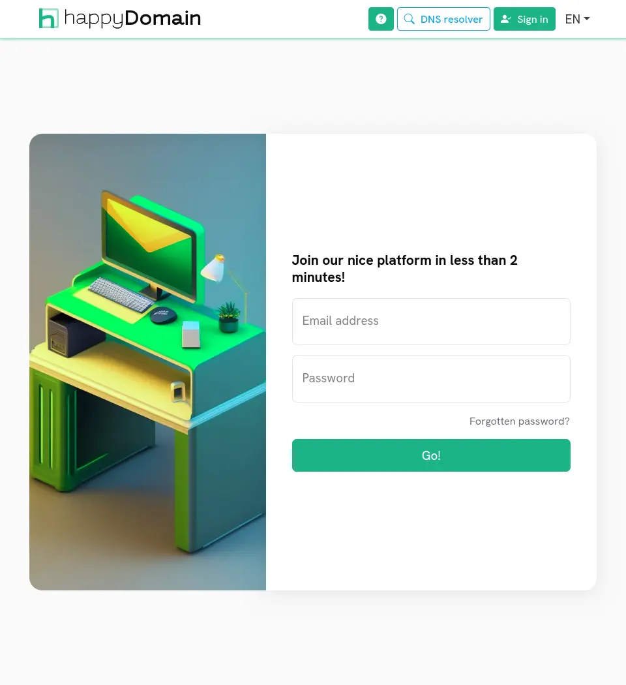
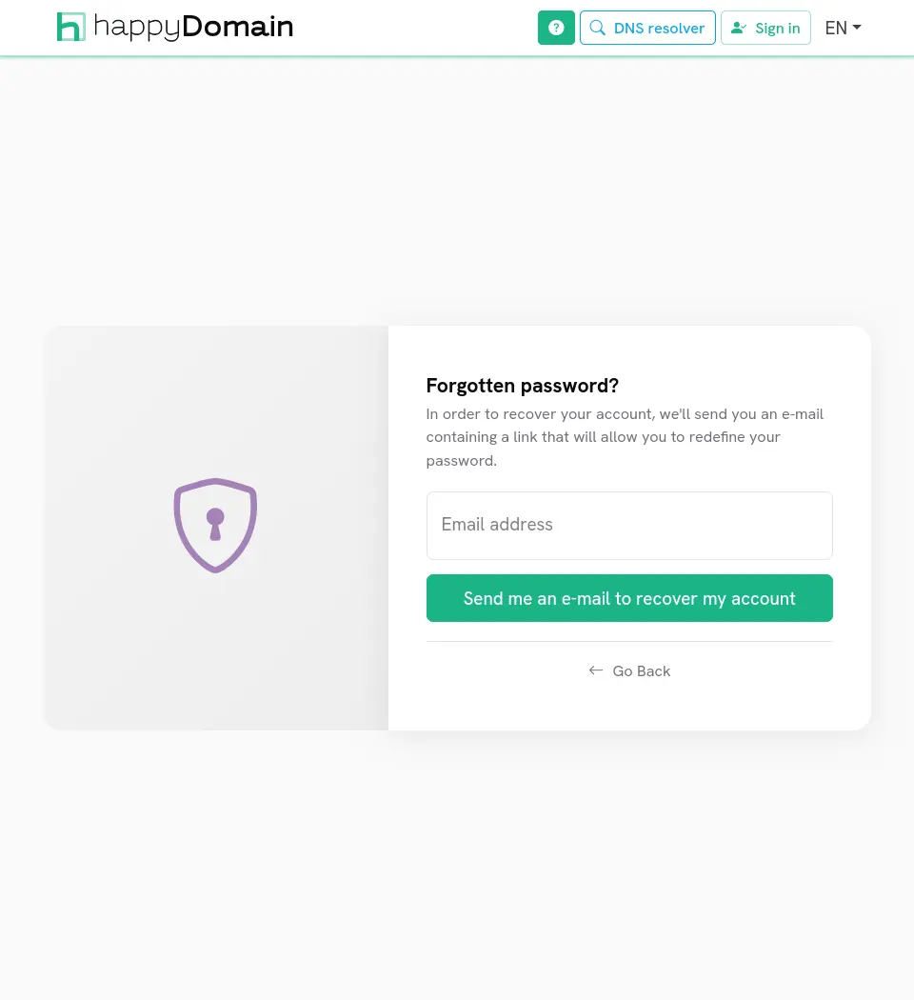

Une fois votre [compte créé]({}) et votre adresse e-mail validée, vous pouvez vous connecter pour accéder à vos domaines.

## Se connecter

Sur la page de connexion, saisissez l'adresse e-mail et le mot de passe choisis lors de l'inscription, puis cliquez sur « C'est parti ».

Si les identifiants sont corrects, vous arrivez sur votre tableau de bord. Sinon, un message d'erreur s'affiche : vérifiez votre adresse et votre mot de passe, puis réessayez.

{}
Pour des raisons de sécurité, le serveur peut vous demander de compléter une vérification anti-robot (captcha) après plusieurs échecs, ou limiter temporairement les nouvelles tentatives. Patientez un instant, puis réessayez.
{}

### Se connecter avec un fournisseur externe

Lorsque le serveur est configuré pour cela, un bouton supplémentaire permet de se connecter via un fournisseur d'identité externe (par exemple Google, GitLab, GitHub, Microsoft ou Apple). Cliquez dessus pour être redirigé vers ce fournisseur et vous y authentifier.

## Mot de passe oublié

Si vous ne vous souvenez plus de votre mot de passe, cliquez sur « Mot de passe oublié ? » sous le formulaire de connexion.

Saisissez l'adresse e-mail de votre compte, puis cliquez sur « Envoyer le lien de récupération ». Si un compte correspond, un message contenant un lien de récupération est envoyé à cette adresse.

Ouvrez le lien depuis votre messagerie pour accéder au formulaire de récupération de compte, où vous pourrez définir un nouveau mot de passe :

1. Saisissez votre **nouveau mot de passe** (il doit respecter les mêmes exigences de robustesse qu'à l'inscription).
2. Ressaisissez-le dans le champ de **confirmation**.
3. Cliquez sur « Redéfinir mon mot de passe ».

Une fois le mot de passe redéfini, vous êtes redirigé vers la page de connexion pour vous identifier avec vos nouveaux identifiants.

{}
Sur les instances fonctionnant sans service de messagerie, la récupération de mot de passe n'est pas disponible : cliquer sur « Mot de passe oublié ? » affiche un message vous invitant à contacter l'administrateur du serveur pour réinitialiser votre mot de passe.
{}
