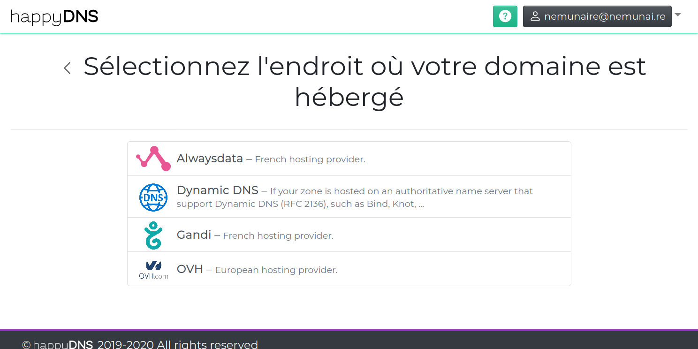

You access this screen by clicking on the ["My domain providers"]({}) link in the top menu, then by clicking on the "+ Add a new domain host" button.

## Compatible registries and domain hosts

When you want to add a domain, the first step is to determine at which host it is located.

In this screen, you will be asked to select the host among the list of compatible hosts where you have your:

Once you have selected it, you are directed to the [Host connection settings]({}) screen.

More will be added later, if you can't find yours, contact us!
