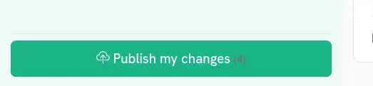
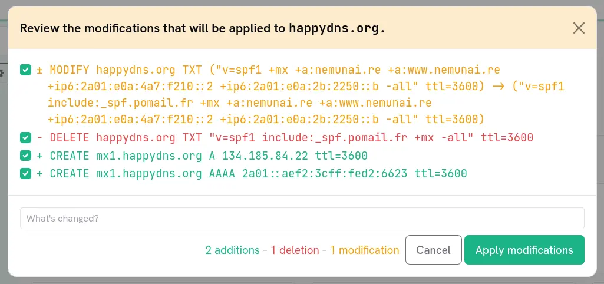

Lorsque vous effectuez un changement dans happyDomain, celui-ci n'est pas immédiatement répercuté auprès de votre hébergeur. Vos modifications s'accumulent dans une copie de travail, et rien n'est transmis à votre hébergeur tant que vous n'avez pas décidé de publier. Avant cela, happyDomain vous permet d'examiner la liste exacte des changements produits par vos modifications, d'ajuster finement ce qui sera appliqué, et de consigner un message dans votre historique.

## Ouvrir le différentiel

Dans l'éditeur de zone, le bouton « Diffuser mes changements » affiche un petit compteur indiquant le nombre de changements en attente détectés pour votre zone. Cliquez dessus pour ouvrir la fenêtre de relecture.

happyDomain calcule la différence entre la zone telle qu'elle existe actuellement chez votre hébergeur et la copie de travail que vous avez éditée. Si tout est déjà synchronisé, un message vous indiquera simplement qu'il n'y a rien à appliquer.

## Comprendre le différentiel

Chaque ligne du différentiel décrit une correction concrète, formulée de façon lisible et colorée selon sa nature :

| Couleur | Signification |
|---------|---------------|
| **Vert** | Un ajout (un enregistrement créé) |
| **Rouge** | Une suppression (un enregistrement retiré) |
| **Jaune** | Une modification (un enregistrement existant modifié) |
| **Bleu** | Un autre type de changement (par exemple un réordonnancement ou une opération propre à l'hébergeur) |

En bas de la fenêtre, un **résumé** récapitule le nombre d'ajouts, de suppressions et de modifications actuellement sélectionnés.

## Choisir les changements à appliquer

Chaque ligne du différentiel comporte une case à cocher. Par défaut, les changements sont listés pour votre relecture, et c'est vous qui décidez lesquels conserver :

- **Décochez** tout changement que vous ne souhaitez pas appliquer maintenant. Il reste dans votre copie de travail et réapparaîtra la prochaine fois.
- Ne laissez cochés que les changements dont vous êtes sûr.

C'est utile lorsque vous avez fait plusieurs modifications sans rapport entre elles mais ne voulez en publier qu'une partie, ou lorsque vous souhaitez déployer un changement sensible séparément.

Le résumé et le bouton d'application se mettent à jour en direct selon votre sélection. Si rien n'est sélectionné, le bouton d'application reste désactivé.

## Rédiger un message de validation

Avant d'appliquer, saisissez un message dans le champ « Qu'est-ce qui a changé ? ». Ce message est consigné dans votre historique aux côtés des changements.

{}
Le différentiel décrit les opérations techniques, mais c'est votre message qui rendra votre historique lisible plus tard. Lorsque vous aurez besoin de revoir ce que vous avez fait, « Déplacement du courrier vers un nouvel hébergeur » est bien plus facile à comprendre que de reconstituer le sens à partir d'une liste de changements d'IP.
{}

## Une étape de confirmation par sécurité

Selon les [préférences de votre compte]({}), happyDomain peut afficher un écran de confirmation supplémentaire après que vous avez choisi d'appliquer :

- Il demande à votre hébergeur de **préparer** les corrections, puis vous montre exactement combien d'opérations l'hébergeur exécutera réellement pour votre sélection.
- Si ce nombre diffère de ce que vous avez sélectionné (par exemple parce qu'un changement était déjà appliqué, ou parce que l'hébergeur décompose un changement en plusieurs), un avertissement s'affiche pour que vous puissiez vérifier avant de confirmer.

Vous pouvez configurer si cette confirmation apparaît toujours, jamais, ou uniquement lorsque les corrections préparées ne correspondent pas à votre sélection.

<!-- TODO: screenshot de l'écran de confirmation montrant les corrections préparées -->

## Après la publication

Une fois que vous confirmez, happyDomain envoie les changements sélectionnés à votre hébergeur et consigne l'opération, avec votre message, dans le journal du domaine. Vous pouvez ensuite consulter les déploiements passés à tout moment, et [revenir à un état antérieur]({}) si besoin.

Pour inspecter la zone résultante elle-même plutôt que le différentiel, ou pour en conserver une copie sous forme de fichier de zone standard, consultez la page [Importer et exporter]({}).
