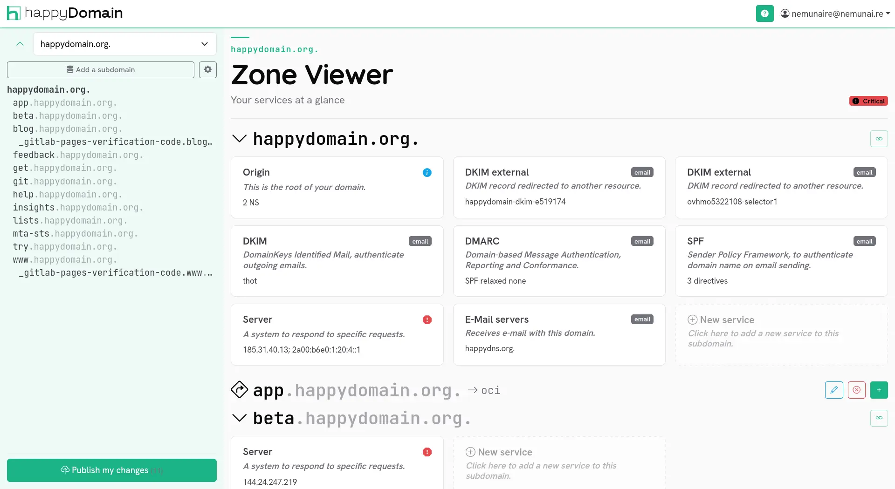
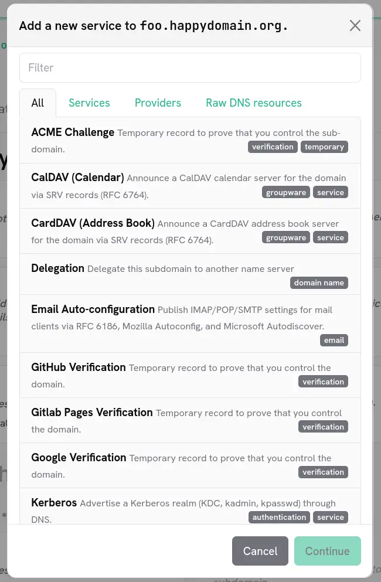

happyDomain does not ask you to think in terms of individual DNS records. Instead, it groups the records that belong together into a single, meaningful **service**: a mailbox, a website, a delegation, a CAA policy, and so on. This is the foundation of the [abstract view]({}) of your zone.

## What is a service?

A service is a higher-level object that hides the complexity of one or several DNS records behind a clear, purpose-driven form.

For example, instead of editing a raw `MX` record, a couple of `A`/`AAAA` records and an `SPF` `TXT` record separately, you fill in a single **email** service. happyDomain takes care of generating the right records, with the right names and the right syntax.

Each service belongs to a family:

- **Services** (abstract): the recommended, human-friendly objects (email, website, CAA, delegation, ...). They map to one or more records automatically.
- **Providers**: services tied to a specific third party that publishes its own helper (for example a hosted service that needs a predefined set of records).
- **Raw DNS resources**: a fallback that lets you add a single record (`A`, `TXT`, `SRV`, ...) directly, when no abstract service fits your need.

{}
Working with services means you do not have to remember the exact record types, their order, or their syntax. happyDomain validates your input and generates valid DNS for you, which greatly reduces the risk of a misconfiguration.
{}

## The service view of a subdomain

When you open a domain, each subdomain is displayed as a list of the services attached to it. A subdomain can hold several services at once: for instance the apex (`@`) of a domain often carries an email service, a website service and a CAA policy together.

From this view you can:

- **Add** a new service to the subdomain.
- **Edit** an existing service to change its values.
- **Delete** a service you no longer need.

All these changes are staged locally and only applied to your provider when you publish them. See the [abstract view]({}) for how editing and propagation work.

## Adding a service to a subdomain

To attach a new service, start from the subdomain where you want it (see [Subdomains]({}) for navigating the zone), then follow these steps.

### 1. Open the service selector

Click the **Add service** action on the subdomain. A selector opens, listing every service type you can add.

The selector is organised in tabs so you can narrow down the list:

- **All**: every available service type.
- **Services**: the abstract, high-level services (recommended).
- **Providers**: services specific to a provider.
- **Raw DNS resources**: a single record type when you need full control.

You can also type in the search box at the top to filter the list by name. Pressing Enter selects the first available match.

{}
Some service types may appear disabled. This happens when the service cannot be added in the current context: for example because your DNS provider does not support the underlying record type, or because that service already exists on this subdomain and only one instance is allowed. Hover over a disabled entry to see the reason.
{}

### 2. Choose the service type

Select the service that matches what you want to publish. happyDomain knows which record types your provider supports, so only the relevant choices are offered. To check what a given provider can handle, see the [Provider features]({}) page.

### 3. Fill in the service form

happyDomain then presents a form tailored to the chosen service. Each field corresponds to a meaningful piece of information (a target host, a priority, a public key, a policy value, ...) rather than to raw record syntax.

<!-- TODO: screenshot of a service edit form -->

Fill in the fields, then confirm to add the service to the subdomain.

### 4. Review the generated records

Once the form is validated, happyDomain converts your input into the corresponding DNS records and adds them to the staged zone. You can review them in the [abstract view]({}) before publishing your changes to your provider.

## Trying services without an account

happyDomain also offers a public **record generator** where you can build and preview the DNS records produced by a service without signing in. Pick a service type, enter a domain name, fill in the form, and the generated zone-file entries are displayed instantly.

This is a handy way to discover how a given service maps to actual DNS records, or to grab a record you will paste elsewhere.

<!-- TODO: screenshot of the public record generator -->
