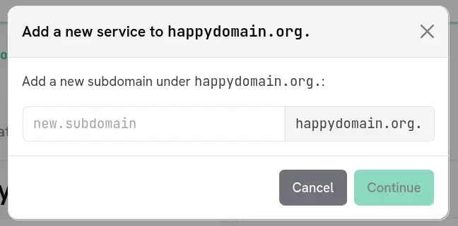

Un domaine est rarement plat : il se compose d'une racine (l'apex, noté `@`) et d'une hiérarchie de sous-domaines tels que `www`, `mail` ou `blog.staging`. happyDomain présente cette hiérarchie de façon claire et navigable, afin que vous puissiez retrouver et gérer rapidement chaque partie de votre zone.

## La liste des sous-domaines

Lorsque vous ouvrez un domaine, la barre latérale de gauche affiche la liste des sous-domaines pour la version de zone sélectionnée. Chaque entrée est présentée sous la forme d'un chemin relatif au domaine, l'apex étant affiché sous la forme du nom de domaine lui-même.

Cette liste se comporte comme une table des matières :

- elle est **indentée** pour refléter la hiérarchie : un sous-domaine est décalé vers la droite en fonction de sa profondeur dans l'arbre, si bien que `blog.staging` apparaît imbriqué sous `staging` ;
- cliquer sur une entrée **fait défiler** le panneau principal jusqu'au sous-domaine correspondant ;
- au fil de votre défilement dans la zone, la barre latérale **met en évidence** le sous-domaine que vous consultez et suit automatiquement votre position.

Les niveaux intermédiaires qui ne portent aucun service propre restent affichés, de sorte que l'arbre demeure cohérent et facile à lire. (Pour les zones inverses, seules les entrées réelles sont listées.)

## Gérer un sous-domaine

Dans le panneau principal, chaque sous-domaine regroupe les [services]({}) qui lui sont rattachés. Vous pouvez y ajouter, modifier ou supprimer des services. L'ajout d'un service à un sous-domaine existant est détaillé dans la page [Services]({}).

## Créer un nouveau sous-domaine

Pour créer un sous-domaine entièrement nouveau (qui n'existe pas encore dans votre zone), utilisez l'action **Ajouter un sous-domaine**, en haut de la barre latérale.

<!-- TODO: capture d'écran du bouton « Ajouter un sous-domaine » -->

### 1. Saisir le nom du sous-domaine

Une fenêtre s'ouvre et vous demande le nouveau sous-domaine à créer sous votre domaine. Saisissez le nom **relatif au domaine** : par exemple, entrez `www` pour créer `www.example.com`, ou `blog.staging` pour créer un chemin imbriqué en une seule fois.

Le nom est validé au fur et à mesure de la saisie. Vous n'avez besoin de fournir que la partie située à gauche de votre nom de domaine ; happyDomain ajoute le domaine pour vous.

{}
Laissez le champ vide (ou utilisez `@`) pour viser la racine du domaine elle-même. Vous pouvez aussi créer plusieurs niveaux d'un coup en saisissant un chemin avec des points, comme `a.b.c` : les niveaux intermédiaires sont créés au besoin.
{}

### 2. Ajouter un premier service

Créer un sous-domaine n'a de sens que s'il porte au moins un service : happyDomain enchaîne donc directement avec le sélecteur de services dès que vous confirmez le nom. Choisissez le type de service et remplissez son formulaire exactement comme décrit dans la page [Services]({}).

Le nouveau sous-domaine apparaît alors dans la barre latérale et dans le panneau principal, avec le service que vous venez d'ajouter.

{}
Créer un sous-domaine et son service ne contacte pas immédiatement votre hébergeur DNS. Comme toute autre modification, l'opération est préparée localement et n'est envoyée à votre hébergeur qu'au moment de la publication de la zone. Consultez la [vue abstraite]({}) pour savoir comment vérifier et appliquer vos modifications.
{}

## Autres actions sur le domaine

À côté du bouton **Ajouter un sous-domaine**, un menu donne accès aux actions concernant l'ensemble du domaine, notamment :

- consulter l'[historique]({}) des versions de la zone ;
- consulter le journal d'audit des modifications ;
- configurer les [vérifications]({}) du domaine ;
- effectuer une recherche WHOIS ;
- afficher ou réimporter la zone, ou téléverser un fichier de zone ;
- retirer le domaine de happyDomain.
